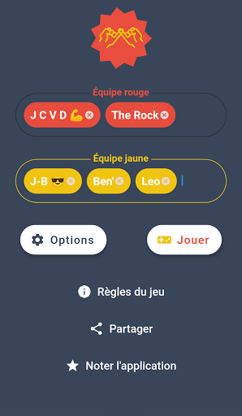

# Le Jeu De La Complicité

   
Prouvez votre connivence dans ce jeu oral de rapidité et de coopération.

1. Construisez 2 équipes de 2 à ∞ joueurs.
2. Piochez un mot aléatoirement.
3. Faîtes deviner le mot à vos coéquipiers par n'importe quel moyen oral sans que l'équipe adverse ne le trouve avant.

Pour gagner, la meilleure voie est la suivante: passer par la complicité que vous partagez.

Exemple: Le mot pioché est "Titanic"
❌ "C'est un film avec Leonardo Di Caprio" est un indice trop global car il peut être compris par vos adversaires en premier.
✔️ "Rappelle toi, le mois dernier on a vu un film ensemble, on mangeait du popcorn sucré devant" est un souvenir partagé avec votre complice que l'équipe adverse peut difficilement trouver et comprendre.
